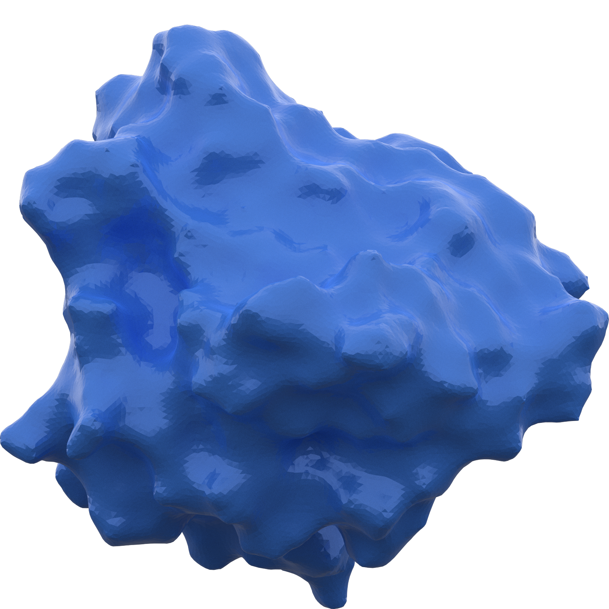

# sas_mol_surface
There's been a lot of work on generating solvent-accessible surfaces over the years. The best (fastest, low memory, fewest weird mesh faces) available is in ChimeraX. This repo has a bunch of data exploring how to generate a SAS using Poisson surface reconstruction or some other tools used to analyse point clouds from surveying data. The results are much worse than ChimeraX but they look cool when combined with a fun rendering library `fresnel`:

 
